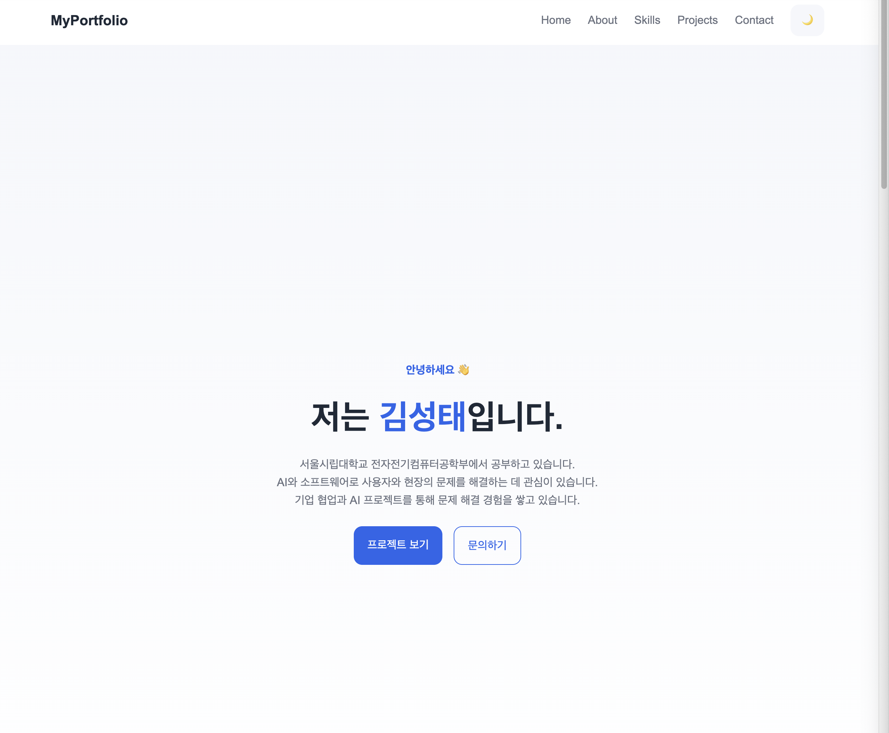
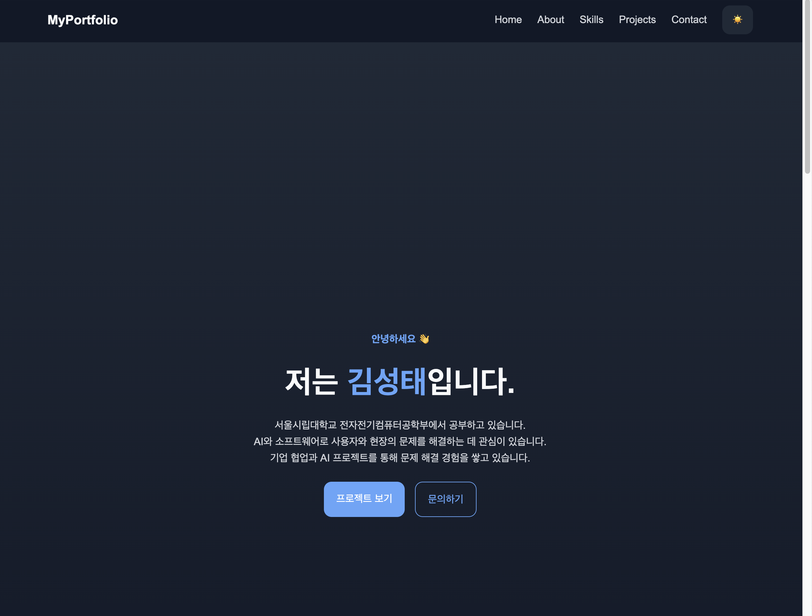
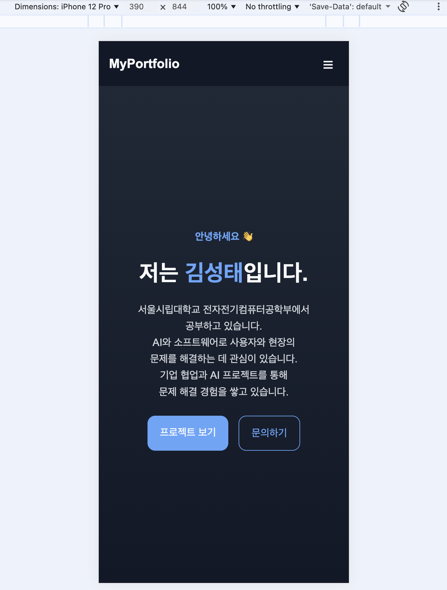
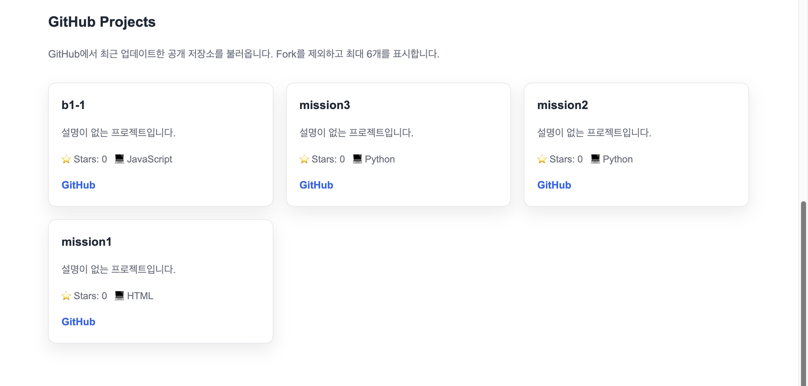
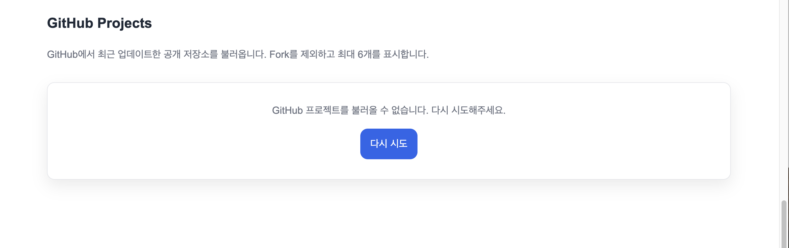

# 김성태 | Portfolio Website

순수 **HTML, CSS, JavaScript**만 사용하여 제작한 반응형 포트폴리오 웹사이트입니다.  
외부 프레임워크 없이 웹의 기본 동작 원리인 **이벤트 → 상태 변경 → DOM 업데이트** 흐름을 직접 구현하는 것을 목표로 했습니다.

---

## 저장소

- GitHub Repository: https://github.com/tjdxo/b1-1
- GitHub Profile: https://github.com/tjdxo
- GitHub Pages 배포 여부와 공개 URL은 아직 확인하지 않았습니다.

---

## 프로젝트 소개

서울시립대학교 전자전기컴퓨터공학부 김성태의 프로젝트 경험을 소개하는 개인 포트폴리오이자 HTML/CSS/JavaScript 기초 학습 과제입니다. 기존 섹션과 인터랙션을 유지하면서 실제 경험을 반영했습니다.

### Featured Projects

- **Flat-on**: 디스플레이허브와 협업한 반자동 캐비닛 평탄화 장치. 팀장으로 기업 컨택, 현장 인터뷰, 설계·검증 및 일정 조율에 참여했습니다. 직무혁신 성과 팀 공모전 최우수상, 특허 출원 진행.
- **Energy AI Workflow Hackathon**: n8n, Lovable, Slack을 활용한 ESS 운영 의사결정 지원 Workflow를 기획·구현했습니다. 고려대학교 Energy AI Workflow Hackathon 금상.

대표 프로젝트는 정적 article 카드이며, 그 아래 GitHub Projects는 기존 API로 별도 렌더링합니다. Skills에 표시한 경험 기술과 위 프로젝트의 도구는 이 웹사이트의 의존성이 아닙니다.

주요 목표는 다음과 같습니다.

- 시맨틱 HTML 구조 설계
- CSS 변수 기반 테마 관리
- 모바일 퍼스트 반응형 레이아웃 구현
- JavaScript를 이용한 DOM 조작과 이벤트 처리
- GitHub API 연동
- 로딩 / 성공 / 에러 / 빈 상태 UI 처리
- 다크 모드 상태 유지
- 폼 유효성 검사 구현

---

## 사용 기술

- HTML5
- CSS3
- JavaScript (ES6+)
- GitHub API

---

## 주요 기능

### 1. 반응형 웹사이트
- 모바일 퍼스트 방식으로 제작
- 태블릿: **768px 이상**
- 데스크톱: **1024px 이상**
- Hero, About, Skills, Projects, Contact, Footer 섹션 구성

### 2. 인터랙션 UI
- 햄버거 메뉴 토글
- 부드러운 스크롤 이동
- 스크롤 탑 버튼
- 스크롤 시 헤더 스타일 변경
- 스크롤 애니메이션
- 다크 모드 토글 및 저장

### 3. GitHub API 연동
- GitHub 저장소 목록 동적 렌더링
- 로딩 상태 표시
- 에러 상태 표시 + 재시도 버튼
- 빈 데이터 상태 표시

### 4. 폼 유효성 검사
- 이름, 이메일, 메시지 필수값 검사
- 이메일 형식 검사
- 입력 필드별 에러 메시지 출력
- 검증 완료 메시지 출력 (실제 전송 없음)
- 오류 필드의 aria-invalid 갱신 및 첫 오류 필드로 포커스 이동
- 검증 완료 후에도 입력 내용 유지

---

## 폴더 구조

```bash
b1-1/
├── index.html
├── README.md
├── css/
│   └── style.css
├── js/
│   └── main.js
└── images/
    └── profile.jpg
```

---

## 구현 섹션

- Header / Navigation
- Hero
- About
- Skills
- Projects: Featured Projects + GitHub Projects
- Contact
- Footer

---

## 구현 상세

### 시맨틱 마크업
웹페이지 구조를 명확하게 표현하기 위해 다음 시맨틱 태그를 사용했습니다.

- `<header>`
- `<nav>`
- `<main>`
- `<section>`
- `<article>`
- `<footer>`

이렇게 작성하면 구조를 이해하기 쉽고, 접근성과 유지보수성 측면에서도 유리합니다.

### 레이아웃 방식
- **Flexbox**: 헤더 네비게이션, 버튼 정렬, 푸터 링크 정렬
- **Grid**: Skills 목록, Projects 카드 목록

사용 기준은 다음과 같습니다.

- 한 줄 또는 한 방향 정렬: **Flexbox**
- 여러 행/열 카드 배치: **Grid**

---

## 상태 관리 흐름

이 프로젝트는 다음과 같은 **상태 → 렌더링** 흐름을 포함합니다.

### 1. 다크 모드
- 사용자 클릭
- `theme` 상태 변경
- `data-theme` 속성 변경
- 전체 화면 스타일 변경
- `localStorage` 저장

### 2. GitHub 프로젝트 목록
- 페이지 로드
- `projectsStatus = "loading"`
- API 요청
- 성공 / 에러 / 빈 상태로 분기
- Projects 영역 UI 업데이트

### 3. 폼 유효성 검사
- 사용자 입력
- 입력값 검증
- `formErrors` 상태 변경
- 에러 메시지 표시 또는 제거

---

## JavaScript에서 사용한 핵심 개념

- `querySelector`, `querySelectorAll`
- `addEventListener`
- `classList.add`, `remove`, `toggle`
- `textContent`, `innerHTML`
- `event.preventDefault()`
- 화살표 함수
- 템플릿 리터럴
- 구조분해 할당
- 배열 메서드
  - `map()`
  - `filter()`
  - `forEach()`
- `fetch`
- `async / await`
- `try / catch`
- `IntersectionObserver`

---

## GitHub API 연동

GitHub API를 사용해 내 저장소 목록을 불러오도록 구현했습니다.

- Endpoint: `https://api.github.com/users/tjdxo/repos?sort=updated`

Fork 저장소를 제외하고 최근 업데이트 순으로 최대 6개를 표시합니다. 계정은 `js/main.js`의 `GITHUB_USERNAME`에서 설정합니다.

처리한 상태는 다음과 같습니다.

- **로딩 상태**: `로딩 중...`
- **성공 상태**: 프로젝트 카드 렌더링
- **에러 상태**: 에러 메시지 + 다시 시도 버튼
- **빈 상태**: `표시할 프로젝트가 없습니다.`

또한 GitHub API의 레이트 리밋(403 응답) 상황도 에러 상태로 처리했습니다.

---

## 상호작용 기준값

현재 구현의 기준값은 아래와 같습니다.

- 스크롤 탑 버튼 표시 기준: **300px**
- 헤더 스타일 변경 기준: **60px**
- Intersection Observer threshold: **0.2**

---

## 접근성 및 UX 고려 사항

- 모든 이미지에 의미 있는 `alt` 속성 작성
- 폼의 `label`과 입력 요소의 `id` 연결
- 버튼과 링크에 hover 효과 제공
- 다크 모드 상태 저장으로 사용자 경험 향상

---

## 스크린샷

아래 5개 화면으로 데스크톱 테마, 모바일 반응형 레이아웃, GitHub Projects의 정상·오류 상태를 확인합니다.
**현재는 캡처 전입니다.** 직접 촬영한 PNG 파일을 아래 경로에 추가하면 이미지가 표시됩니다. 파일명은 대소문자까지 동일하게 맞춰주세요.

| 화면 | 저장 경로 | 확인할 내용 |
| --- | --- | --- |
| 데스크톱 라이트 모드 | `images/screenshot-desktop-light.png` | 밝은 테마, 전체 섹션, 프로젝트 카드 배치 |
| 데스크톱 다크 모드 | `images/screenshot-desktop-dark.png` | 같은 화면의 어두운 테마와 텍스트 가독성 |
| 모바일 라이트 모드 | `images/screenshot-mobile.png` | 390px 너비, 햄버거 메뉴 버튼, 프로젝트 카드 1열 배치 |
| GitHub Projects 정상 | `images/screenshot-github-success.png` | API로 불러온 저장소 카드와 링크 |
| GitHub Projects 오류 | `images/screenshot-github-error.png` | GitHub Projects의 오류 메시지와 다시 시도 버튼 |

### 데스크톱 · 라이트 모드



### 데스크톱 · 다크 모드



### 모바일



### GitHub Projects · 정상 화면

GitHub API 요청에 성공하면 저장소 카드와 GitHub 링크를 표시합니다.



### GitHub Projects · 오류 화면

오류 상태에서는 안내 메시지와 **다시 시도** 버튼을 표시합니다. 아래 캡처 가이드에서는 화면 상태를 직접 변경해 오류 UI를 미리 봅니다.



### 캡처 방법 · Mac의 Chrome 기준

1. Live Server로 페이지를 열고 GitHub 프로젝트가 로딩될 때까지 기다립니다.
2. **전체 페이지를 천천히 끝까지 스크롤한 뒤 맨 위로 돌아옵니다.** 스크롤 애니메이션이 적용된 섹션이 나타나야 전체 화면 캡처에서 내용이 빠지지 않습니다.
3. 데스크톱은 화면 너비를 1024px 이상(권장 1440px)으로 맞춥니다. 페이지의 달/해 버튼으로 테마를 바꿔 라이트·다크 화면을 각각 캡처합니다.
4. Chrome 개발자도구를 `⌘ + ⌥ + I`로 엽니다. 개발자도구에 포커스를 둔 상태에서 `⌘ + ⇧ + P`를 누르고 `Capture full size screenshot`을 검색·실행하면 전체 페이지 PNG를 저장할 수 있습니다.
5. GitHub Projects의 정상·오류 영역만 촬영할 때는 Mac의 `⌘ + ⇧ + 4`로 해당 영역을 선택해도 됩니다. 다운로드한 파일을 위 이름으로 변경하고 `images/`에 넣습니다. 이미지 파일도 README와 함께 커밋합니다.

### 컴퓨터에서 모바일 화면 보기

1. 개발자도구를 연 상태에서 `⌘ + ⇧ + M`을 누르거나 휴대폰·태블릿 모양의 **Toggle device toolbar** 버튼을 클릭합니다.
2. 상단 기기 선택에서 **Responsive**를 선택하고 너비 **390**, 높이 **844**로 설정합니다.
3. 가로 넘침이 없는지, 햄버거 메뉴가 열리고 닫히는지, 프로젝트 카드가 1열인지 확인합니다. 모바일에서 테마 버튼은 햄버거 메뉴 안에 있습니다.
4. 라이트 모드에서 메뉴를 닫고, 전체 페이지를 스크롤한 뒤 위의 전체 화면 캡처 방법으로 저장합니다.
5. `⌘ + ⇧ + M`을 다시 누르면 데스크톱 화면으로 돌아옵니다. 이 기능은 화면 크기 등을 모사하므로 실제 휴대폰 테스트를 완전히 대체하지는 않습니다.

### GitHub Projects 정상·오류 화면 캡처

1. Network 설정을 **No throttling**으로 두고 페이지를 정상적으로 엽니다.
2. GitHub Projects에 저장소 카드가 나타나면 제목과 카드가 함께 보이도록 캡처해 `images/screenshot-github-success.png`로 저장합니다.
3. 개발자도구의 **Console**에서 아래 코드를 실행해 오류 화면을 표시합니다.

```js
state.projectsStatus = "error";
state.projectsErrorMessage = "GitHub 프로젝트를 불러올 수 없습니다. 다시 시도해주세요.";
renderProjects();
```

4. 같은 테마와 화면 너비에서 GitHub Projects 제목, 오류 메시지, **다시 시도** 버튼을 캡처해 `images/screenshot-github-error.png`로 저장합니다.
5. **다시 시도** 버튼을 눌러 API를 다시 호출하고 정상 카드가 표시되는지 확인합니다.

위 코드는 현재 페이지의 표시 상태만 바꾸는 **오류 UI 미리보기**입니다. 실제 네트워크 장애를 재현하거나 소스 파일을 수정하지 않습니다. 정상 화면은 실제 API 조회 결과를 촬영합니다.

참고: [Chrome 개발자도구 단축키](https://developer.chrome.com/docs/devtools/shortcuts), [모바일 화면 및 스크린샷](https://developer.chrome.com/docs/devtools/device-mode), [네트워크 오프라인 모드](https://developer.chrome.com/docs/devtools/network).

---

## 실행 방법

1. 저장소를 클론합니다.

```bash
git clone https://github.com/tjdxo/b1-1.git
```

2. 프로젝트 폴더로 이동합니다.

```bash
cd b1-1
```

3. VS Code에서 프로젝트를 엽니다.

4. Live Server로 `index.html`을 실행합니다. 별도의 빌드나 패키지 설치는 필요하지 않습니다.

---

## 개발 환경

- 순수 HTML, CSS, JavaScript 사용
- 외부 라이브러리 미사용
- API 저장소 조회에는 인터넷 연결이 필요합니다.

---

## 아쉬운 점 / 개선 방향

- 현재 Contact 폼은 실제 전송 없이 프론트엔드 검증만 구현되어 있습니다.
- 실제 메시지 전송 기능은 이번 과제 범위에 포함하지 않았습니다.
- 프로젝트 필터링, 타이핑 효과, 시스템 다크 모드 감지 기능도 추가 가능합니다.

---

## 배운 점

이 프로젝트를 통해 다음을 직접 구현하며 이해할 수 있었습니다.

- HTML 구조를 시맨틱하게 설계하는 방법
- Flexbox와 Grid를 상황에 맞게 선택하는 방법
- JavaScript로 이벤트를 연결하고 DOM을 조작하는 흐름
- `fetch`와 `async/await`를 이용한 비동기 데이터 처리
- 상태에 따라 화면을 다르게 렌더링하는 방식
- React로 넘어가기 전 필요한 웹 기초 개념
